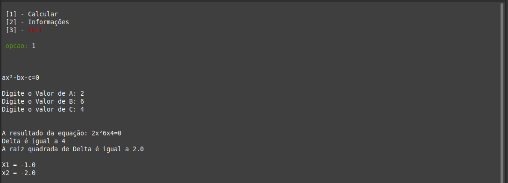

<h1 align="center">🏅 ESG - Equação do Segundo Grau</h1>

<p align="center">
    
    &nbsp;&nbsp;
    &nbsp;&nbsp;
    
</p>

<p align="center">
    <a href="#Technology">Technology</a>&nbsp;&nbsp;&nbsp;|&nbsp;&nbsp;&nbsp;
    <a href="#Project">Project</a>&nbsp;&nbsp;&nbsp;|&nbsp;&nbsp;&nbsp;
    <a href="#Installation">Installation</a>&nbsp;&nbsp;&nbsp;|&nbsp;&nbsp;&nbsp;
    <a href="#Technology">Technology</a>&nbsp;&nbsp;&nbsp;|&nbsp;&nbsp;&nbsp;
    <a href="#License">License</a>
</p>

<h2 id="Project">💻 About the Project</h2>

This project was developed based on facilitating the solving of equations of the second degree currently in version 1.0.0, this project is not something serious I just did it for fun and besides learning a lot of new things in this project I had a lot of fun while developing.

It also comes with a complete tutorial to learn how to solve `Second Degree Equations`.

<h2 id="Installation">How To Use 🔧</h2>
---

if you don't have ruby installed use
```bash
sudo apt-get install ruby-full
```
if you already have ruby installed use
```bash
# Clone this repository
$ git clone https://github.com/lietsondossanto/agen

# Go into the repository
$ cd agen

# give execution permission
chmod +x app.rb

# run
$ ruby app.rb
```

If everything is correct on your terminal, the following will be printed:


There we see three options, which are:

  - Calular:&nbsp; Serves to calculate the equation of the second degree.
  - Information:&nbsp; will give more information about the application and also information on how to solve a second degree equation.
  - Exit:&nbsp; as well as the name says, it is used to exit the app.

### [1] - calcular
Then, if you click Calculate, the following will be printed on your terminal:

 

On this screen, based on the message that came in first, it will ask for the value of A, B and C to be able to calculate the equation of the second degree.

 

 After entering the value of A, B and C, the following will be printed to your terminal: the delta value the value of the square root of delta the value of X1 and of course the value of X2.

### [2] - Informações
If you click on information, the following will be printed on your terminal:


We see three options that are

- How to do a second degree equation: &nbsp; In this option he will print a complete tutorial on how to make a second degree equation

- About:&nbsp; This option will print all information from the app on your terminal.

- Exit:&nbsp; Exit the app

<h2 id="Technology">🚀 Technology</h2>

- Ruby

## Author

- **Lietson dos santos** - [https://github.com/lietsondossanto](https://github.com/lietsondossanto)

<h2 id="License">License 📄</h2>

This project is licensed under the MIT License - see the [LICENSE.md](LICENSE.md) file for details

[](https://twitter.com/https://twitter.com/lietsondossanto) [](mailto:lietsondossanto@gmail.com)
